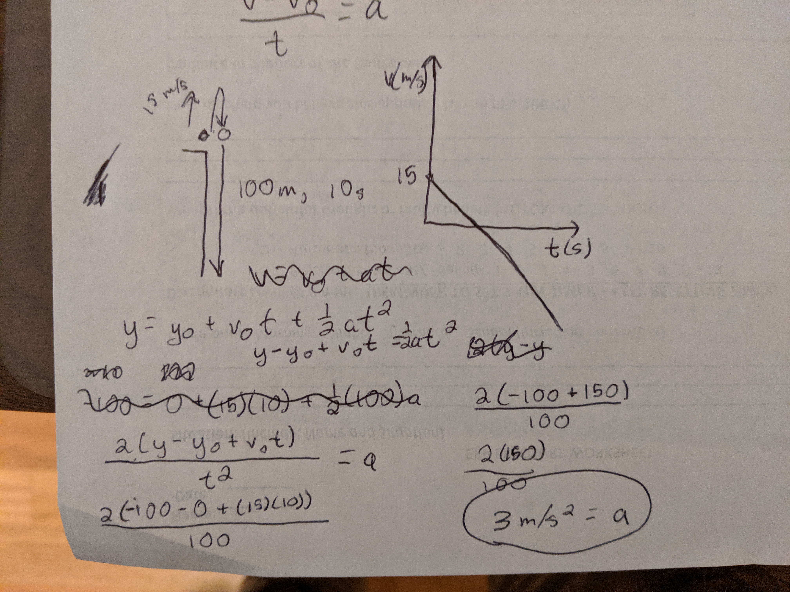
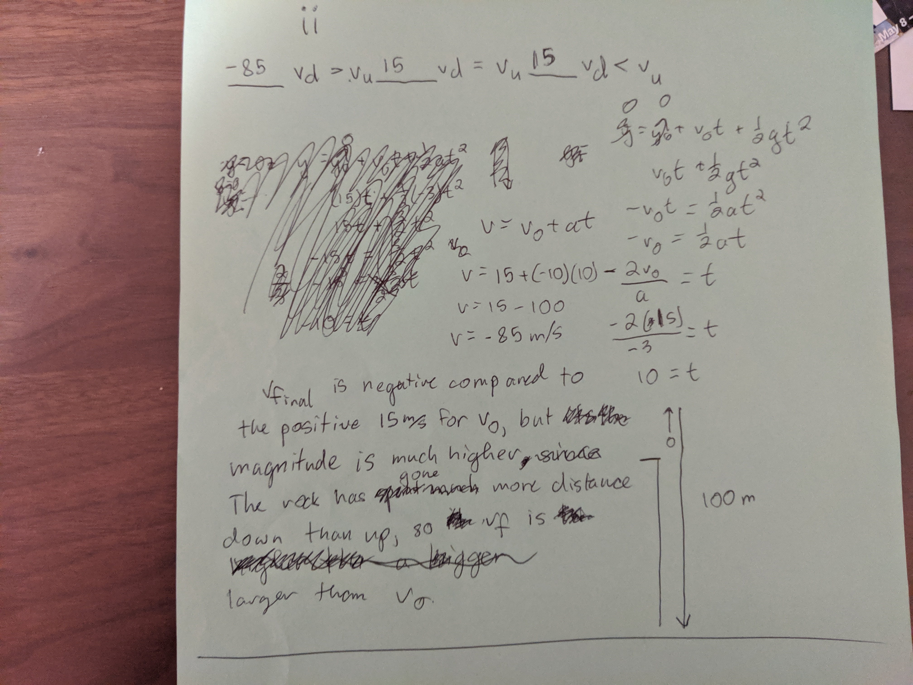

<html>
  <head>
    <title>Project: Claudius</title>
    <meta charset="utf8">
    
  </head>
  <body>
    

      <h1>PROJECT: CLAUDIUS</h1>
      <ul>
        <li>operation no: 1647</li>
        <li>date assigned: September 14, 1994</li>
        <li>clearance level: 29</li>
      </ul>
    

    
   

     
Congratulations. You have successfully navigated to the location of the classified Claudius      files. Share these with no one. If you do, thousands will come after you. And they will find you. You have been warned. 

   

   
   

      <h2>Section One</h2>
      
Transcripts from the 
      

        
        
        
      
 
    
 
  </body>
</html>
